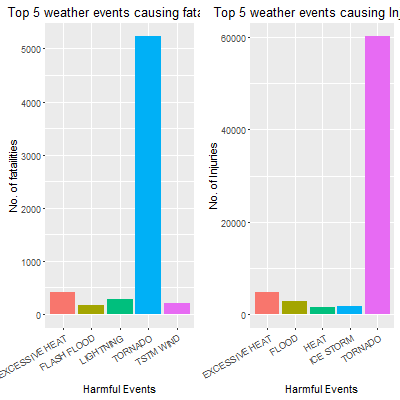
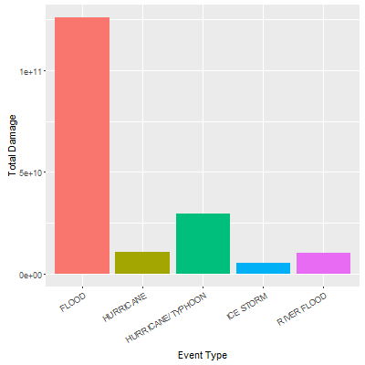

#Assignment
##Introduction
This project involves exploring the U.S. National Oceanic and Atmospheric Administration’s (NOAA) storm database. This database tracks characteristics of major storms and weather events in the United States, including when and where they occur, as well as estimates of any fatalities, injuries, and property damage. The analysis below will analyze the major storm events causing injuries and fatalities. Similarly, we will also examine the major Storm Event causing highest property damage.

##Synopsis
The analysis on the storm event database revealed that tornadoes are the most dangerous weather event to the populations health. The second most dangerous event type is excessive heat. The economic impact of weather events was also analyzed. Flash floods and thunderstorm winds caused billions of dollars in property damages between 1950 and 2011. The largest damage to crops were caused by droughts, followed by floods and hailing.

The basic goal of this assignment is to explore the NOAA Storm Database and answer some basic questions about severe weather events. You must use the database to answer the questions below and show the code for your entire analysis. Your analysis can consist of tables, figures, or other summaries. You may use any R package you want to support your analysis.

#Data Processing LOADING and READING data
```r
#required libraries
library("ggplot2")
library("gridExtra")
library("R.utils")

#download from url and bunzip
fileurl<-"https://d396qusza40orc.cloudfront.net/repdata%2Fdata%2FNOAA_storm_data.csv.bz2"
filepath <- file.path(getwd(), "repdata_Fdata_FNOAA_storm_data.csv.bz2")
download.file(fileurl,filepath)
#unzip and read 
bunzip2("repdata_Fdata_FNOAA_storm_data.csv.bz2", overwrite = F)
NOAA_storm_data <- read.csv("repdata_Fdata_FNOAA_storm_data.csv", sep = ",")

# other files
fileurl<-"https://d396qusza40orc.cloudfront.net/repdata%2Fpeer2_doc%2Fpd01016005curr.pdf"
filepath <- file.path(getwd(), "repdata_Fpeer2_doc_Fpd01016005curr.pdf")
download.file(fileurl,filepath)

fileurl<-"https://d396qusza40orc.cloudfront.net/repdata%2Fpeer2_doc%2FNCDC%20Storm%20Events-FAQ%20Page.pdf"
filepath <- file.path(getwd(), "repdata_Fpeer2_doc_FNCDC_0Storm_Events-FAQ_Page.pdf")
download.file(fileurl,filepath)

summary(NOAA_storm_data)

# Trim the data set to required columns only
storm_Event <- NOAA_storm_data[, c("BGN_DATE", "EVTYPE", "FATALITIES", "INJURIES","PROPDMG", "PROPDMGEXP", "CROPDMG", "CROPDMGEXP")]

# Create subset for Question 1 and Question 2

# Select data for Fatalities and injuries for Question 1
event_Health <- subset(storm_Event, !storm_Event$FATALITIES == 0 & !storm_Event$INJURIES == 0, select = c(EVTYPE, FATALITIES, INJURIES))

# Select data for Property Damage and Crop Damage for Question 2
event_Economic <- subset(storm_Event, !storm_Event$PROPDMG == 0 & !storm_Event$CROPDMG == 0, select = c(EVTYPE, PROPDMG, PROPDMGEXP, CROPDMG, CROPDMGEXP))
```

#Questions
Your data analysis must address the following questions:
##1.Across the United States, which types of events (as indicated in the EVTYPE variable) are most harmful with respect to population health?
###Data Processing
it will prepare required data to present most harmful events
```r

# Create separate data set for Injury and Fatalities Fatalities
event_Health_Death <- aggregate(event_Health$FATALITIES, by = list(event_Health$EVTYPE), FUN = sum)

# Give proper name for columns
colnames(event_Health_Death) <- c("EVENTTYPE", "FATALITIES")

# Injury
event_Health_Inj <- aggregate(event_Health$INJURIES, by = list(event_Health$EVTYPE), FUN = sum)
# Give column name
colnames(event_Health_Inj) <- c("EVENTTYPE", "INJURIES")

# Let's reorder 2 dataset and filter top 5 events for both dataset
event_Health_Death <- event_Health_Death[order(event_Health_Death$FATALITIES, decreasing = TRUE),][1:5, ]

event_Health_Inj <- event_Health_Inj[order(event_Health_Inj$INJURIES, decreasing = TRUE),][1:5, ]

```
###Results
top 5 major case of Both fatalities and injuries
```r
# plot top 5 events for fatalities and injuries

# Plot Fatalities and store at Death_plot
Death_plot <- ggplot() + geom_bar(data = event_Health_Death, aes(x = EVENTTYPE, y = FATALITIES, fill = interaction(FATALITIES, EVENTTYPE)), stat = "identity", 
show.legend = F) + theme(axis.text.x = element_text(angle = 30, hjust = 1)) + xlab("Harmful Events") + ylab("No. of fatailities") + ggtitle("Top 5 weather events causing fatalities") +  theme(axis.text.x = element_text(angle = 30, hjust = 1))

# Plot injuries and store at variable Inj_plot
Inj_plot <- ggplot() + geom_bar(data = event_Health_Inj, aes(x = EVENTTYPE, y = INJURIES, fill = interaction(INJURIES, EVENTTYPE)), stat = "identity", show.legend = F) + 
  theme(axis.text.x = element_text(angle = 30, hjust = 1)) + xlab("Harmful Events") + ylab("No. of Injuries") + ggtitle("Top 5 weather events causing Injuries") + 
  theme(axis.text.x = element_text(angle = 30, hjust = 1))

# Draw two plots generated above dividing space in two columns

grid.arrange(Death_plot, Inj_plot, ncol = 2)
dev.copy(png,"plot1.png",width=400,height=400)
dev.off()

```
  

tornado is the major cause with respect to population health, both for causing fatalities and injuries

##2.Across the United States, which types of events have the greatest economic consequences?
Consider writing your report as if it were to be read by a government or municipal manager who might be responsible for preparing for severe weather events and will need to prioritize resources for different types of events. However, there is no need to make any specific recommendations in your report.
###Data Processing
it will required data to present most harmful events with respect to the economic damages.
```r
event_Economic <- subset(event_Economic, event_Economic$PROPDMGEXP == "K" | event_Economic$PROPDMGEXP ==  "k" | event_Economic$PROPDMGEXP == "M" | event_Economic$PROPDMGEXP == "m" | 
                          event_Economic$PROPDMGEXP == "B" | event_Economic$PROPDMGEXP == "b")

event_Economic <- subset(event_Economic, event_Economic$CROPDMGEXP == "K" | event_Economic$CROPDMGEXP ==  "k" | event_Economic$CROPDMGEXP == "M" | event_Economic$CROPDMGEXP == "m" | 
                          event_Economic$CROPDMGEXP == "B" | event_Economic$CROPDMGEXP == "b")

# Convert ecnomic values to number
event_Economic$PROPDMGEXP <- gsub("m", 1e+06, event_Economic$PROPDMGEXP, ignore.case = TRUE)
event_Economic$PROPDMGEXP <- gsub("k", 1000, event_Economic$PROPDMGEXP, ignore.case = TRUE)
event_Economic$PROPDMGEXP <- gsub("b", 1e+09, event_Economic$PROPDMGEXP, ignore.case = TRUE)
event_Economic$PROPDMGEXP <- as.numeric(event_Economic$PROPDMGEXP)
event_Economic$CROPDMGEXP <- gsub("m", 1e+06, event_Economic$CROPDMGEXP, ignore.case = TRUE)
event_Economic$CROPDMGEXP <- gsub("k", 1000, event_Economic$CROPDMGEXP, ignore.case = TRUE)
event_Economic$CROPDMGEXP <- gsub("b", 1e+09, event_Economic$CROPDMGEXP, ignore.case = TRUE)
event_Economic$CROPDMGEXP <- as.numeric(event_Economic$CROPDMGEXP)
event_Economic$PROPDMGEXP <- as.numeric(event_Economic$PROPDMGEXP)

# then sum the damages by each event type
event_Economic$TOTALDMG <- (event_Economic$CROPDMG * event_Economic$CROPDMGEXP) +  (event_Economic$PROPDMG * event_Economic$PROPDMGEXP)
event_Economic <- aggregate(event_Economic$TOTALDMG, by = list(event_Economic$EVTYPE), FUN = sum)
colnames(event_Economic) <- c("EVTYPE", "TOTALDMG")

# Rank the event type by highest damage cost and take top 5 columns
event_Economic <- event_Economic[order(event_Economic$TOTALDMG, decreasing = TRUE), ]
event_Economic <- event_Economic[1:5, ]
```
###Results
```r
# Now plot the graph
ggplot() + geom_bar(data = event_Economic, aes(x = EVTYPE, y = TOTALDMG, fill = interaction(TOTALDMG, EVTYPE)), stat = "identity", show.legend = F) + theme(axis.text.x = element_text(angle = 30, hjust = 1)) + xlab("Event Type") + ylab("Total Damage")

dev.copy(png,"plot2.png",width=400,height=400)
dev.off()
```
  

Flood is the major cause with respect to cost of damage.

###Summary
From above data and graphs, we found that tornado is the major cause with respect to population health, both for causing fatalities and injuries, while Flood is the major cause with respect to cost of damage.